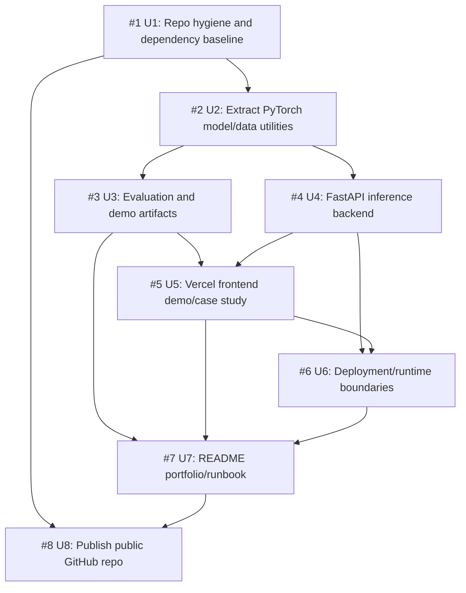

# Satellite Segmentation Demo Dependency Map

This dependency map records how the portfolio-ready satellite segmentation demo was broken into implementation units and how those units depend on each other. It mirrors the GitHub tracker issue so the project plan remains available from the repository itself.

## Issue Graph

## Implementation Units

| Issue | Unit | Primary surface | Depends on |
| --- | --- | --- | --- |
| #1 | Repository hygiene and dependency baseline | Root config, requirements, ignores | None |
| #2 | Extract PyTorch model and data utilities | `src/satseg/`, notebooks | #1 |
| #3 | Build evaluation and demo artifact pipeline | `scripts/`, `docs/evaluation/` | #2 |
| #4 | Implement FastAPI inference backend | `backend/` | #2 |
| #5 | Build Vercel frontend demo and case study | `frontend/` | #3, #4 |
| #6 | Configure deployment and runtime boundaries | `docs/deployment.md`, deployment config | #4, #5 |
| #7 | Rewrite README as portfolio and technical runbook | `README.md` | #3, #5, #6 |
| #8 | Publish public GitHub repository | Public repo surface, publication policy | #1, #7 |

## Recommended Execution Order

1. Start with #1 to make the repo safe and reproducible.
2. Do #2 next because it defines the shared extraction layer for scripts, backend, and downstream docs.
3. Parallelize #3 and #4 after #2 lands.
4. Start #5 after #3 provides static artifacts and #4 provides the API contract.
5. Do #6 after #4 and #5 expose concrete runtime and configuration needs.
6. Do #7 once generated artifacts, frontend, backend, and deployment docs are stable enough to cite.
7. Finish with #8 when the public repository surface is clean.

## Parallelization Notes

Good candidates after #2 lands:

- Worktree A: #3 evaluation and demo artifacts. Mostly Python scripts, metrics, and `docs/evaluation/`.
- Worktree B: #4 backend inference service. Mostly `backend/` plus package integration.

Good candidates after #3 and #4 land:

- Worktree C: #5 frontend demo and case study.
- Worktree D: #6 deployment docs and config, with a final reconciliation against #5 before merge.

Best saved for later:

- #7 README should wait until #3, #5, and #6 are real enough to cite.
- #8 publication should remain serial and final.

## Coordination Notes

- #2 should define stable module APIs before #3 and #4 split into separate worktrees.
- #3 should write generated artifacts in a format #5 can consume directly.
- #4 should document response shape early so #5 can integrate without guessing.
- #6 should document environment variables and hosting boundaries without hardcoding deployment-only values.

## Verification

- Every implementation unit from `docs/plans/2026-06-23-001-feat-satellite-demo-deployment-plan.md` has a corresponding GitHub issue.
- Dependencies are visible in both the tracker issue and this repository document.
- The final README links to this map so the implementation structure remains discoverable after the tracker issue is closed.
