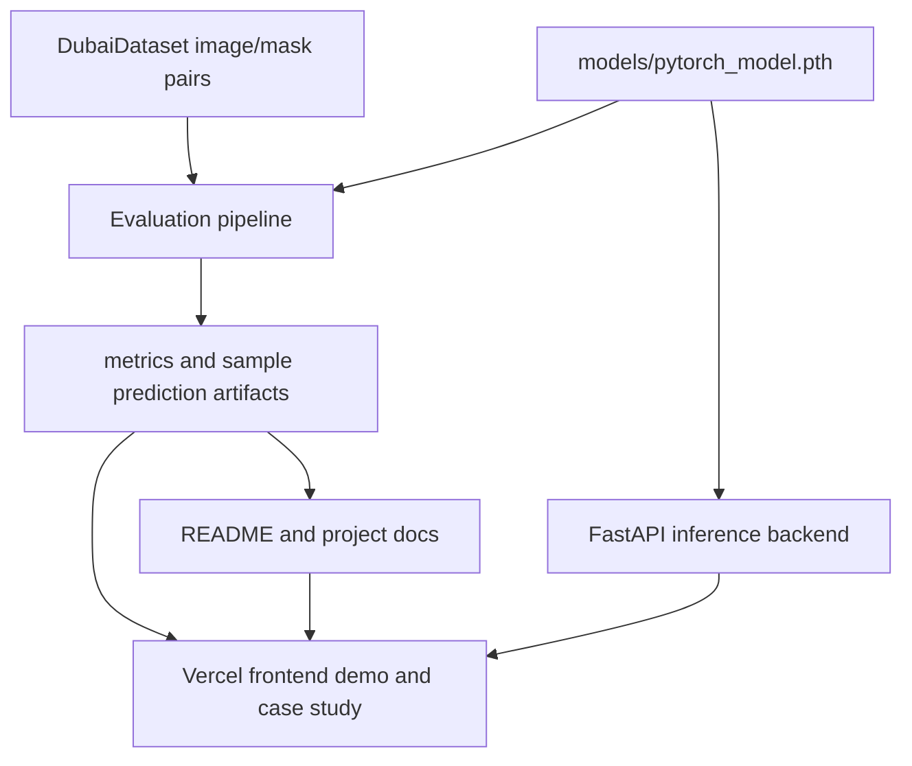

# feat: Build satellite segmentation demo and deployment

## Summary

Build the project into a public portfolio-ready satellite segmentation product: reproducible PyTorch evaluation, a model inference backend, a Vercel-hosted interactive frontend, a hybrid README, and GitHub-ready repository hygiene. The plan prioritizes evaluation credibility before app polish so the deployed demo can explain both what the model predicts and how well it performs.

---

## Problem Frame

The current project has the right raw ingredients: a Dubai satellite dataset, a PyTorch segmentation notebook, trained model weights, and early demo assets. The work is still notebook-centered, so viewers cannot reliably try it, reproduce evaluation, or distinguish a strong demo from a trustworthy ML workflow. The requirements doc frames v1 as demo-first with model evidence nearby; this plan turns that product shape into implementation units.

---

## Requirements

**Model and Evaluation**

- R1. The PyTorch path must become reproducible outside ad hoc notebook execution while keeping `notebook/segmentation_pytorch.ipynb` as the source context from the origin requirements.
- R2. Evaluation must produce validation/test metrics, per-class IoU, class distribution, and representative success/failure artifacts for the case study.
- R3. Inference must load the 6-class `models/pytorch_model.pth` contract consistently, including the unlabeled ignore class behavior.

**Demo Product**

- R4. The deployed frontend must let viewers run or inspect segmentation without knowing the notebook workflow.
- R5. The result experience must include input imagery, segmentation visualization, class legend, and demo-quality disclaimers.
- R6. The app must include curated samples so the demo remains useful even when users do not upload their own image.
- R7. The case-study surface must explain why IoU and per-class behavior matter more than pixel accuracy alone.

**Packaging and Publication**

- R8. The project must have a hybrid README that works as both a portfolio landing page and a technical runbook.
- R9. Vercel must host the frontend while PyTorch inference can run on a separate backend suited to model serving.
- R10. The repository must be publishable as a public GitHub repo without accidental local environment files or unmanaged large-artifact surprises.

---

## Key Technical Decisions

- **Package the ML workflow before building the UI.** Evaluation, inference, and artifact generation should move into reusable Python modules/scripts before frontend work depends on them; this prevents notebook state from becoming the app contract.
- **Use a separate inference backend for PyTorch.** Vercel supports Python functions, but Python bundles have a 500 MB uncompressed limit and no automatic tree-shaking; the current model directory alone is about 374 MB, before PyTorch dependencies. A FastAPI container backend is a safer first model-serving target.
- **Deploy the frontend as a static/server-rendered web app on Vercel.** The frontend should call a configurable inference API URL and degrade gracefully to curated sample outputs if the backend is unavailable.
- **Treat evaluation artifacts as generated product data.** Metrics JSON, class legends, sample predictions, and failure examples should be generated once and consumed by README/app surfaces so claims do not drift.
- **Publish only intentional large artifacts.** GitHub supports Git LFS for large files, and this repo has several 93 MB model files near the regular Git warning range; v1 should either keep only the primary model in Git/LFS or move secondary checkpoints to release assets or documented external storage.

---

## High-Level Technical Design



The core dependency direction is model/evaluation first, then inference, then the frontend and README. The deployed app should not calculate case-study claims by hand; it should read generated artifacts from the same evaluation route used by local verification.

---

## Output Structure

Expected structure after implementation:

```text
src/satseg/
  data.py
  model.py
  inference.py
  metrics.py
  visualization.py
scripts/
  evaluate_model.py
  generate_demo_artifacts.py
backend/
  app/
    main.py
    schemas.py
    services/
  tests/
  Dockerfile
frontend/
  app/
  components/
  lib/
  public/
  tests/
docs/
  brainstorms/
  plans/
  evaluation/
README.md
requirements.txt
```

The final tree can adjust during implementation, but the separation should remain: reusable ML code, backend serving code, frontend demo code, generated evaluation artifacts, and documentation.

---

## Implementation Units

### U1. Repository Hygiene and Dependency Baseline

- **Goal:** Make the repository safe to publish publicly and ready for reproducible local work.
- **Requirements:** R8, R10
- **Dependencies:** None
- **Files:** `.gitignore`, `requirements.txt`, `.gitattributes`, `README.md`, `docs/evaluation/`
- **Approach:** Restore an intentional dependency file, expand ignore rules for local/editor artifacts, decide which model files remain in the repo, and add Git LFS tracking or artifact documentation for large checkpoints. Keep `models/pytorch_model.pth` as the primary model unless implementation proves it must be regenerated.
- **Patterns to follow:** Existing `.gitignore` already excludes `.venv`; extend that direction rather than committing local environments.
- **Test scenarios:**
  - Test expectation: none -- repository hygiene has no runtime behavior.
- **Verification:** A clean status view should show only intentional source, docs, dataset, selected model artifacts, and generated outputs; no `.venv`, `.DS_Store`, editor cache, or accidental duplicate checkpoints should be staged for public publishing.

### U2. Extract PyTorch Model and Data Utilities

- **Goal:** Move reusable dataset, mask-conversion, model-construction, inference, and visualization behavior out of the notebook into importable Python modules.
- **Requirements:** R1, R3
- **Dependencies:** U1
- **Files:** `src/satseg/data.py`, `src/satseg/model.py`, `src/satseg/inference.py`, `src/satseg/visualization.py`, `tests/test_data.py`, `tests/test_model.py`, `tests/test_inference.py`
- **Approach:** Preserve the PyTorch notebook's current class-color mapping and 6-class model contract. Keep notebook cells as explanatory workflow, but make scripts and apps call package code instead of copying notebook logic.
- **Execution note:** Add characterization tests against known sample masks before refactoring color-to-class behavior.
- **Patterns to follow:** `notebook/segmentation_pytorch.ipynb` for class mapping, ignore index, model architecture, and preprocessing assumptions.
- **Test scenarios:**
  - Given a mask patch containing every known RGB class color, `data.py` converts each color to the expected class ID, including unlabeled as ignore index.
  - Given a mask patch with an unknown color, conversion assigns the ignore index rather than a valid semantic class.
  - Given `models/pytorch_model.pth`, `model.py` builds a compatible 6-class UNet and loads weights without shape mismatch.
  - Given a valid RGB image array, `inference.py` returns a class-index mask and color overlay with stable dimensions.
- **Verification:** Package imports work from a clean Python process, and tests prove the model/data contract does not rely on notebook state.

### U3. Build Evaluation and Demo Artifact Pipeline

- **Goal:** Generate trustworthy evaluation outputs for the app, README, and case study.
- **Requirements:** R2, R7
- **Dependencies:** U2
- **Files:** `scripts/evaluate_model.py`, `scripts/generate_demo_artifacts.py`, `src/satseg/metrics.py`, `docs/evaluation/metrics.json`, `docs/evaluation/samples/`, `tests/test_metrics.py`
- **Approach:** Evaluate the selected PyTorch model against validation/test splits, output aggregate metrics plus per-class IoU, and generate representative success/failure sample artifacts. Store machine-readable metrics so README and frontend can consume the same source of truth.
- **Patterns to follow:** The corrected `test_loader` behavior from `notebook/segmentation_pytorch.ipynb`; avoid the previous accidental train-dataset evaluation issue.
- **Test scenarios:**
  - Given small synthetic predictions and masks, `metrics.py` computes pixel accuracy while ignoring unlabeled pixels.
  - Given a class absent from both prediction and target, per-class IoU handles the empty-union case without inflating the mean.
  - Given evaluation output, `metrics.json` includes validation metrics, test metrics, per-class IoU, class names, model artifact name, and generation timestamp.
  - Given curated sample inputs, demo artifact generation writes original, prediction, overlay, and metadata entries for each sample.
- **Verification:** Evaluation artifacts can be regenerated from source code and match the data shown in the app and README.

### U4. Implement FastAPI Inference Backend

- **Goal:** Provide a deployable backend that accepts one satellite-style image and returns segmentation output for the frontend.
- **Requirements:** R3, R4, R5, R9
- **Dependencies:** U2
- **Files:** `backend/app/main.py`, `backend/app/schemas.py`, `backend/app/services/inference_service.py`, `backend/tests/test_api.py`, `backend/Dockerfile`, `backend/README.md`
- **Approach:** Build a small API around the packaged inference code, load the model once at startup, validate image inputs, and return a response format the frontend can render. Containerize the backend so it can deploy to a service that supports PyTorch's dependency and memory profile.
- **Patterns to follow:** FastAPI's Docker deployment guidance for container-based deployment; keep the app small and focused on inference.
- **Test scenarios:**
  - Given a valid image upload, the API returns a segmentation overlay or encoded result with class metadata.
  - Given a non-image upload, the API returns a controlled validation error.
  - Given an oversized image, the API rejects or resizes according to the documented backend limit.
  - Given model loading fails at startup, the API exposes a health failure rather than accepting inference requests.
  - Covers F2 / AE2. Given frontend-style upload input, the backend response contains enough data to label output as model prediction.
- **Verification:** Backend tests cover happy path and failure path behavior, and local container startup can load the model and answer a health check.

### U5. Build Vercel Frontend Demo and Case Study

- **Goal:** Create the interactive portfolio surface: upload, curated samples, result visualization, class legend, and case-study sections.
- **Requirements:** R4, R5, R6, R7
- **Dependencies:** U3, U4
- **Files:** `frontend/app/`, `frontend/components/`, `frontend/lib/`, `frontend/public/`, `frontend/tests/`, `frontend/package.json`, `frontend/README.md`
- **Approach:** Build a focused frontend that opens on the demo, reads generated metrics/sample metadata, calls the inference API for uploads, and shows case-study content close to the interaction. Keep the product clear that outputs are model predictions, not ground truth.
- **Patterns to follow:** Existing project imagery in `images/` and generated artifacts from `docs/evaluation/`.
- **Test scenarios:**
  - Covers F1 / AE1. Given a user selects a curated sample, the app displays original image, segmentation result, class legend, and context text.
  - Covers F2 / AE2. Given a user uploads a valid image and the backend returns a prediction, the app displays the output and demo disclaimer.
  - Given the backend is unavailable, the upload state communicates the failure and still allows curated samples to work.
  - Covers F3 / AE3. Given a user opens the evaluation section, per-class IoU and validation/test comparison are visible.
  - Given a narrow mobile viewport, the upload/result layout remains usable without text overlap.
- **Verification:** Frontend tests cover sample selection, upload success/failure states, metrics rendering, and responsive layout snapshots.

### U6. Configure Deployment and Runtime Boundaries

- **Goal:** Make frontend and backend deployment reproducible without coupling Vercel to PyTorch model-serving constraints.
- **Requirements:** R9, R10
- **Dependencies:** U4, U5
- **Files:** `frontend/vercel.json`, `frontend/.env.example`, `backend/.env.example`, `backend/README.md`, `docs/deployment.md`
- **Approach:** Configure the frontend around an inference API base URL, document backend deployment options, and define health checks and CORS expectations. Keep Vercel focused on the user-facing web app and route model inference to the backend.
- **Patterns to follow:** Vercel runtime docs for frontend/serverless limits; FastAPI container deployment concepts for model-serving lifecycle, memory, startup, and restarts.
- **Test scenarios:**
  - Given no inference API URL is configured, the frontend shows curated samples and disables or explains live upload.
  - Given an inference API URL is configured, upload requests target that URL rather than a hardcoded local address.
  - Given backend health is down, the frontend surfaces an unavailable state without breaking the case study.
  - Given deployment docs are followed, a reviewer can identify which service owns frontend hosting and which service owns model inference.
- **Verification:** Deployment docs name required environment variables, service boundaries, and manual smoke checks for both hosted surfaces.

### U7. Rewrite README as Portfolio and Technical Runbook

- **Goal:** Replace the current README with a polished hybrid README aligned to the new product direction.
- **Requirements:** R7, R8, R10
- **Dependencies:** U3, U5, U6
- **Files:** `README.md`, `docs/evaluation/metrics.json`, `docs/deployment.md`
- **Approach:** Lead with what the project does, screenshots or demo placeholders, model/evaluation summary, and deployment links. Follow with setup, data layout, model contract, evaluation reproduction, app/backed architecture, and known limitations.
- **Patterns to follow:** The requirements doc's product language; generated metrics from U3 rather than manually typed values.
- **Test scenarios:**
  - Covers F4 / AE5. Given a developer reads the README, they can identify the primary notebook, model artifact, setup path, and evaluation path.
  - Given a portfolio viewer reads only the top section, they understand the demo, model purpose, and limitations.
  - Given metrics are regenerated, README values can be updated from the same artifacts used by the app.
- **Verification:** README links resolve to existing files, claims match generated evaluation artifacts, and limitations do not overstate model authority.

### U8. Publish Public GitHub Repository

- **Goal:** Publish the cleaned project to a public GitHub repository after the plan and repo hygiene decisions are applied.
- **Requirements:** R8, R10
- **Dependencies:** U1, U7
- **Files:** `.gitignore`, `.gitattributes`, `README.md`, `docs/brainstorms/`, `docs/plans/`
- **Approach:** Use the existing remote if it is the desired public repository; otherwise create a new public repository and set the remote intentionally. Stage only the intended public project surface, avoid committing local artifacts, and push after confirming large model handling.
- **Patterns to follow:** GitHub guidance for large files and Git LFS; keep public repository history understandable for reviewers.
- **Test scenarios:**
  - Test expectation: none -- repository publishing is a release operation, not application behavior.
- **Verification:** The public GitHub page shows the intended README, selected model/data assets are accessible or documented, and no local-only files are present in the pushed tree.

---

## Scope Boundaries

### In Scope

- Reproducible evaluation and inference path for the PyTorch model.
- Interactive demo and case-study frontend.
- Separate backend for model inference when PyTorch serving requires it.
- README rewrite and deployment documentation.
- Public GitHub publication with large-artifact hygiene.

### Deferred to Follow-Up Work

- Training-quality improvements such as augmentation experiments, class imbalance strategies, or backbone comparisons.
- Grad-CAM or attention/explainability views.
- Hosted batch processing, GeoTIFF support, map tiling, coordinate systems, or large-scene workflows.
- User accounts, saved history, and dashboards.

### Outside This Product's Identity for v1

- Authoritative land-use analysis claims.
- Training or retraining from the deployed web app.
- Full GIS platform behavior.

---

## Risks and Dependencies

- **Large model artifacts:** Each checkpoint is near the GitHub large-file warning range; publishing multiple checkpoints creates repo weight and may complicate cloning. Mitigation: publish one primary model, use LFS or releases for large artifacts, and document any omitted checkpoints.
- **Vercel/PyTorch mismatch:** Vercel Python functions have bundle limits that make PyTorch plus model weights risky. Mitigation: keep Vercel as the frontend host and run inference in a container backend.
- **Notebook drift:** If notebooks, scripts, README, and app each define their own metrics, claims will diverge. Mitigation: generate metrics artifacts once and consume them everywhere.
- **Demo image mismatch:** Random uploaded images may not resemble the Dubai training data. Mitigation: support curated samples and label uploads as demo predictions.
- **Backend cold start and model load:** Loading PyTorch weights can be slow. Mitigation: load once at startup and document health/startup behavior.

---

## Documentation and Operational Notes

- README should be rewritten after generated metrics exist so the portfolio claims are real.
- `docs/deployment.md` should explain frontend and backend ownership, required environment variables, health checks, and known limits.
- `docs/evaluation/` should hold generated metrics and sample metadata that both README and frontend can reference.
- Public GitHub publishing should happen after `.gitignore`, dependency files, and large-artifact policy are settled.

---

## Acceptance Examples

- AE1. Given a viewer opens the deployed app with no image, when they choose a sample, then they see the original, segmentation output, legend, and demo context.
- AE2. Given a viewer uploads a satellite-style image, when inference succeeds, then the app shows a prediction and labels it as model output rather than ground truth.
- AE3. Given a technical reviewer reads the case study, when they compare validation and test performance, then they see per-class IoU and an explanation of pixel accuracy limitations.
- AE4. Given the backend is unavailable, when the viewer opens the app, then curated samples and case-study content remain usable.
- AE5. Given a developer clones the public repo, when they read the README, then they can identify setup, evaluation, inference, deployment, and model-artifact expectations.

---

## Sources and Research

- Origin requirements: `docs/brainstorms/2026-06-23-satellite-segmentation-demo-requirements.md`
- Current PyTorch workflow: `notebook/segmentation_pytorch.ipynb`
- Current primary model: `models/pytorch_model.pth`
- Current README: `README.md`
- Vercel Python runtime docs: Python function bundles include reachable files, have no automatic Python tree-shaking, and have a 500 MB uncompressed bundle limit.
- Vercel function duration docs: Vercel functions have configurable maximum durations, but duration alone does not solve package/model bundle size.
- FastAPI Docker deployment docs: container deployment is a normal fit when an app needs managed startup, memory, restarts, and runtime control.
- GitHub LFS docs: Git LFS stores large-file pointers in the repo while GitHub manages the large objects separately, with plan-specific file size limits.
